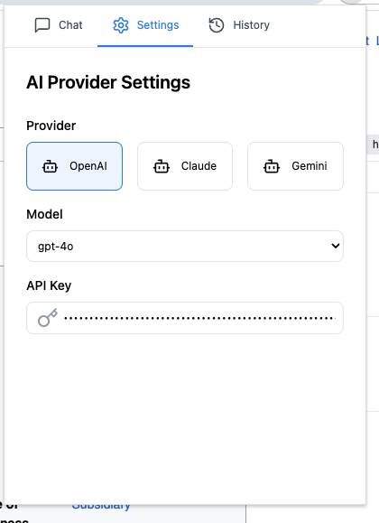
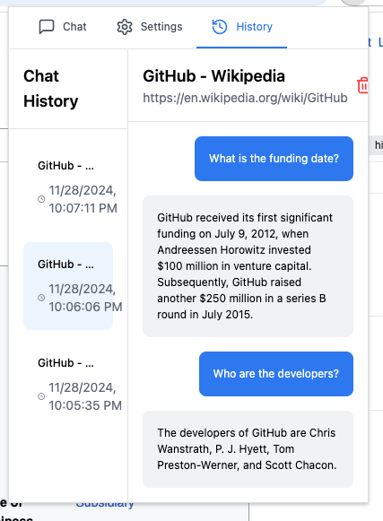

# Chrome GenAI Chat Extension 🤖

A Chrome extension that enables contextual AI chat about webpage content using multiple AI providers (OpenAI, Claude, Gemini).


*AI Provider Settings interface showing multiple model options*

## 🌟 Features

- **Multiple AI Providers**: Support for OpenAI (GPT-4o, GPT-4o-mini), Claude (Claude 3 Opus, Claude 3 Sonnet), and Gemini (Gemini 1.5 Pro, Gemini 1.5 Flash)
- **Contextual Chat**: Instant chat about current webpage content
- **Chat History**: Save and manage your chat history
- **Quick Response**: Enter key support for fast interactions
- **Secure**: API key stored securely in Chrome storage
- **Modern UI**: Clean and intuitive interface


*Chat history interface showing contextual conversations*

## 🚀 Quick Start

### Installation

1. Clone the repository:
```bash
git clone https://github.com/OrenGrinker/chromeGenAIChatExtension.git
cd chromeGenAIChatExtension
```

2. Install dependencies:
```bash
npm install
```

3. Build the extension:
```bash
npm run build
```

4. Load in Chrome:
- Open Chrome and go to `chrome://extensions/`
- Enable "Developer mode"
- Click "Load unpacked"
- Select the `dist` directory

## 🛠️ Development

### Prerequisites

- Node.js >= 18
- npm >= 8
- Chrome browser
- API keys for chosen providers (OpenAI/Claude/Gemini)

### Available Commands

```bash
# Install dependencies
npm install

# Build once
npm run build

# Build and watch for changes
npm run watch
```

### Project Structure

```
chromeGenAIChatExtension/
├── docs/
│   └── images/
│       ├── settings-panel.png
│       └── chat-history.png
├── src/
│   ├── assets/          # Icons and images
│   ├── components/      # React components
│   │   ├── ChatPanel.tsx
│   │   ├── ConfigPanel.tsx
│   │   └── HistoryPanel.tsx
│   ├── types.ts        # TypeScript types
│   ├── popup.tsx       # Main popup component
│   └── index.tsx       # Entry point
├── public/             # Static files
│   └── popup.html
├── manifest.json       # Extension manifest
├── package.json
└── webpack.config.js   # Build configuration
```

## 💡 Usage

1. Click the extension icon in Chrome
2. Select your preferred AI provider
3. Enter your API key
4. Choose your model
5. Start chatting about the current webpage content

## 🔒 Privacy & Security

- API keys stored securely in Chrome storage
- No user data stored remotely
- All communication happens directly with AI providers
- No tracking or analytics

## 🤝 Contributing

1. Fork the repository
2. Create your feature branch:
```bash
git checkout -b feature/amazing-feature
```

3. Commit your changes:
```bash
git commit -m 'Add amazing feature'
```

4. Push to the branch:
```bash
git push origin feature/amazing-feature
```

5. Open a Pull Request

## 📄 License

This project is licensed under the MIT License - see the [LICENSE](LICENSE) file for details.

## 🙏 Acknowledgments

- React and TypeScript for the framework
- OpenAI, Claude, and Gemini for AI capabilities
- Lucide React for icons